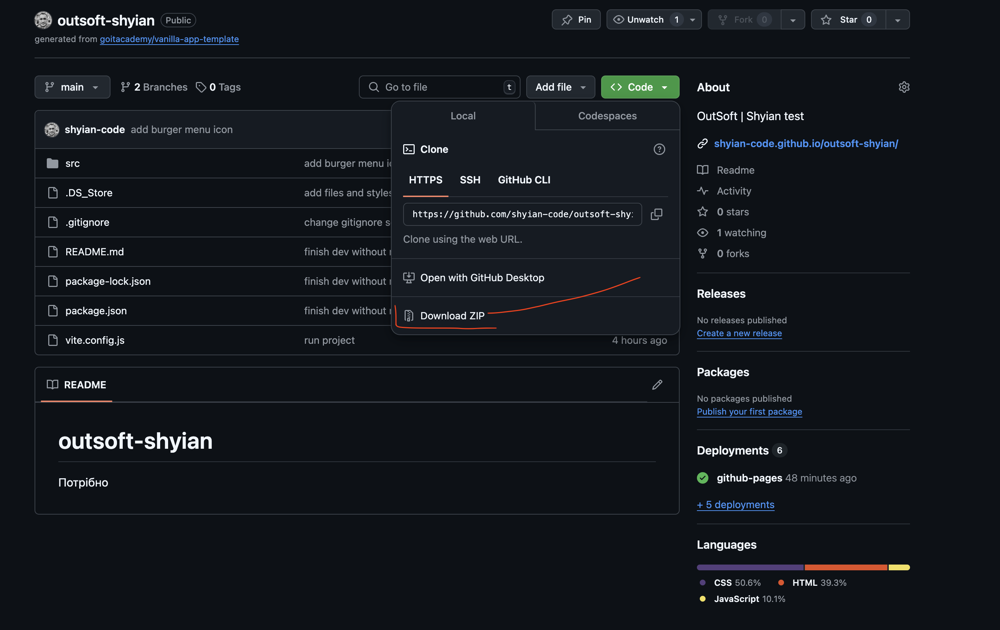

# outsoft-shyian

Потрібно скачати архів 

1. Розпакувати в себе локально
2. Встанови базові залежності проекту в терміналі командою `npm install`.
3. Запусти режим розробки, виконавши в терміналі команду `npm run dev`.
4. Перейдіть у браузері за адресою
   [http://localhost:5173](http://localhost:5173).

## Файли і папки

- Файли розмітки компонентів сторінки знаходяться в папці `src/partials`
- Файли стилів знаходяться в папці `src/css`

## Деплой
В ідеалі деплой повинен відбуватися автоматично на GitHub pages, у гілку `gh-pages`, щоразу, коли оновлюється гілка `main`. Наприклад, після прямого пуша або прийнятого пул-реквесту.

Я спробува декілька разів налаштувати 