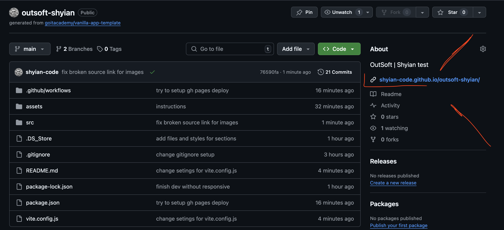
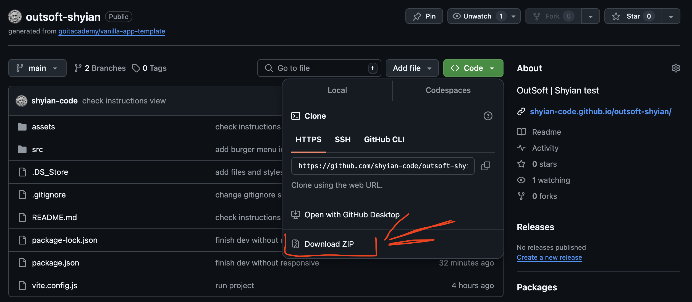

# outsoft-shyian

## GitHub Pages
Для початку спробуйте перейти за посиланням в описі

## Manual downloading and run on you local
Якщо автоматичний деплой не відправцював і мої налатування для GitHub Pages працюю невірно

Потрібно скачати архів 

1. Розпакувати в себе локально
2. Встанови базові залежності проекту в терміналі командою `npm install`.
3. Запусти режим розробки, виконавши в терміналі команду `npm run dev`.
4. Перейдіть у браузері за адресою
   [http://localhost:5173](http://localhost:5173).

## Files
- Файли розмітки компонентів сторінки знаходяться в папці `src/partials`
- Файли стилів знаходяться в папці `src/css`

## Деплой
В ідеалі деплой повинен відбуватися автоматично на GitHub pages, у гілку `gh-pages`, щоразу, коли оновлюється гілка `main`. Наприклад, після прямого пуша або прийнятого пул-реквесту.

Спробува декілька разів налаштувати деплой у двох файлах:
- .github/workflows/deploy.yml
- vite.confeg.js
